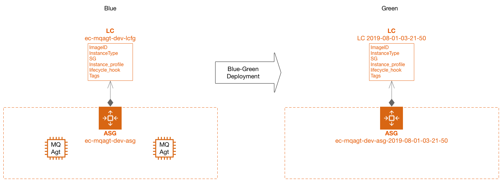
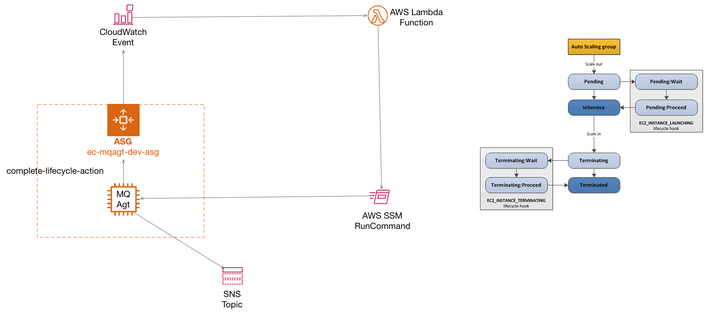

# Blue Green Deployment - Immutable Blue
for Graceful shutdown  

# Use  

- State Machine (AWS Stepfunctions)  
- Lifecycle Hooks (Graceful Shutdown)  
- CodePipeline for State Machine  
- Lambda Layers and X-Ray

# 説明
  

---

  

# Related

- State Machine Design pattern  
- [AWS White Paper [pdf]](https://d1.awsstatic.com/whitepapers/AWS_Blue_Green_Deployments.pdf)  
[Launch configuration update pattern]  

# Operation

##  事前設定

pip, aws cliを最新にしておく
```bash
$ pip install --upgrade pip
$ aws --version
$ sudo pip install --upgrade awscli
```

```bash
$ PROJECTNAME=ec
$ ROLENAME=mqagt
$ ENVIRONMENT=dev
$ MAILADDR=yagita.takashi@gmail.com
$ MYNAME=yagita
```

- LambdaUpload用Bucket  
```bash
$ aws cloudformation create-stack \
--stack-name $PROJECTNAME-$ROLENAME-preparation \
--region ap-northeast-1 \
--template-body file://0-preparation.yml \
--capabilities CAPABILITY_AUTO_EXPAND \
--parameters \
ParameterKey=S3BucketPrefix,ParameterValue=$MYNAME
```

- Layer準備
__packageコマンドはLayerのrequirement.txtを処理してくれないので自分で行う__  
```bash
$ cd lambda/layer/python
$ pip install -r requirements.txt -t .
```

```bash
$ cd ../../..

$ aws cloudformation package \
    --template-file 0-1-preparation.yml \
    --s3-bucket $MYNAME-lambda-for-buluegreen-ap-northeast-1 \
    --output-template-file layers-packaged.yml

$ aws cloudformation deploy \
    --stack-name $PROJECTNAME-lambda-layers \
    --region ap-northeast-1 \
    --template-file layers-packaged.yml \
    --output text
```

##  preparation

```bash
$ aws cloudformation create-stack \
--stack-name $PROJECTNAME-vpc-security \
--region ap-northeast-1 \
--template-body file://0-vpc-security.yml \
--capabilities CAPABILITY_NAMED_IAM \
--parameters \
ParameterKey=ProjectName,ParameterValue=$PROJECTNAME \
ParameterKey=RoleName,ParameterValue=$ROLENAME \
ParameterKey=Environment,ParameterValue=$ENVIRONMENT
```

1  
```bash
$ aws cloudformation create-stack \
--stack-name $PROJECTNAME-vpc \
--region ap-northeast-1 \
--template-body file://1-vpc.yml \
--capabilities CAPABILITY_NAMED_IAM \
--parameters \
ParameterKey=ProjectName,ParameterValue=$PROJECTNAME \
ParameterKey=RoleName,ParameterValue=$ROLENAME \
ParameterKey=Environment,ParameterValue=$ENVIRONMENT

```

2
```bash
$ aws cloudformation create-stack \
--stack-name $PROJECTNAME-$ROLENAME-blue \
--region ap-northeast-1 \
--template-body file://2-blue.yml \
--capabilities CAPABILITY_NAMED_IAM \
--parameters \
ParameterKey=ProjectName,ParameterValue=$PROJECTNAME \
ParameterKey=RoleName,ParameterValue=$ROLENAME \
ParameterKey=Environment,ParameterValue=$ENVIRONMENT \
ParameterKey=OperatorEMail,ParameterValue=$MAILADDR

```

2-2
```bash
$ aws cloudformation package \
    --template-file 2-2-blue-lifecycle.yml \
    --s3-bucket $MYNAME-lambda-for-buluegreen-ap-northeast-1 \
    --output-template-file lcycl-packaged.yml

$ aws cloudformation deploy \
    --stack-name $PROJECTNAME-$ROLENAME-blue-lifecycle \
    --region ap-northeast-1 \
    --template-file lcycl-packaged.yml \
    --capabilities CAPABILITY_NAMED_IAM CAPABILITY_AUTO_EXPAND \
    --output text \
    --parameter-overrides \
        ProjectName=$PROJECTNAME \
        RoleName=$ROLENAME \
        Environment=$ENVIRONMENT \
        OperatorEMail=$MAILADDR
```

3
```bash
$ aws cloudformation package \
    --template-file 3-bluegreen-deployment.yml \
    --s3-bucket $MYNAME-lambda-for-buluegreen-ap-northeast-1 \
    --output-template-file sfn-packaged.yml

$ aws cloudformation deploy \
    --stack-name $PROJECTNAME-$ROLENAME-bluegreen-deployment \
    --region ap-northeast-1 \
    --template-file sfn-packaged.yml \
    --capabilities CAPABILITY_NAMED_IAM \
    --output text \
    --parameter-overrides \
        ProjectName=$PROJECTNAME \
        RoleName=$ROLENAME \
        Environment=$ENVIRONMENT \
        LambdaS3Bucket=$MYNAME-lambda-for-buluegreen-ap-northeast-1
```

# 4 CodePipelineからStepfunctionsを呼び出す

## 4-0 CodeCommitの準備
```bash
$ aws cloudformation create-stack \
--stack-name $PROJECTNAME-$ROLENAME-bluegreen-pipeline-preparation \
--region ap-northeast-1 \
--template-body file://0-pipeline-preparation.yml \
--capabilities CAPABILITY_NAMED_IAM \
--parameters \
ParameterKey=ProjectName,ParameterValue=$PROJECTNAME \
ParameterKey=RoleName,ParameterValue=$ROLENAME \
ParameterKey=Environment,ParameterValue=$ENVIRONMENT \
ParameterKey=OperatorEMail,ParameterValue=$MAILADDR
```

__コンソールから./pipeline/state_machine_input.jsonをcommitする__

## 4-1 CodePipelineの準備
```bash
$ aws cloudformation package \
    --template-file 4-bluegreen-snf-pipeline.yml \
    --s3-bucket $MYNAME-lambda-for-buluegreen-ap-northeast-1 \
    --output-template-file pipeline-packaged.yml

$ aws cloudformation deploy \
    --stack-name $PROJECTNAME-$ROLENAME-bluegreen-pipeline \
    --region ap-northeast-1 \
    --template-file pipeline-packaged.yml \
    --capabilities CAPABILITY_NAMED_IAM CAPABILITY_AUTO_EXPAND \
    --output text \
    --parameter-overrides \
        ProjectName=$PROJECTNAME \
        RoleName=$ROLENAME \
        Environment=$ENVIRONMENT \
        RepositoryBranch=master

```


# StepFunctionsの実行

$ STATE_MACHINE_ARN=arn:aws:states:ap-northeast-1:338456725408:stateMachine:ec-mqagt-dev-BlueGreen

$ aws stepfunctions start-execution \
--state-machine-arn $STATE_MACHINE_ARN \
--input '{
    "project": "ec",    
    "blue": {
      "asg_name": "ec-mqagt-dev-asg"
    },
    "Wait": 30
}'

